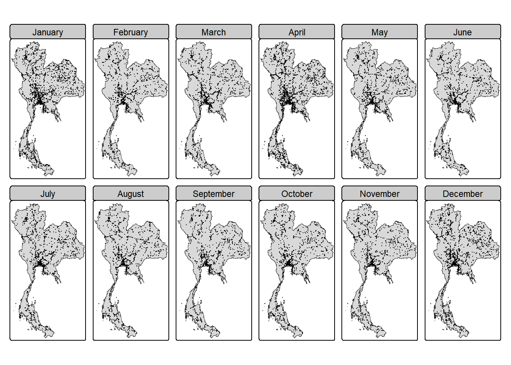
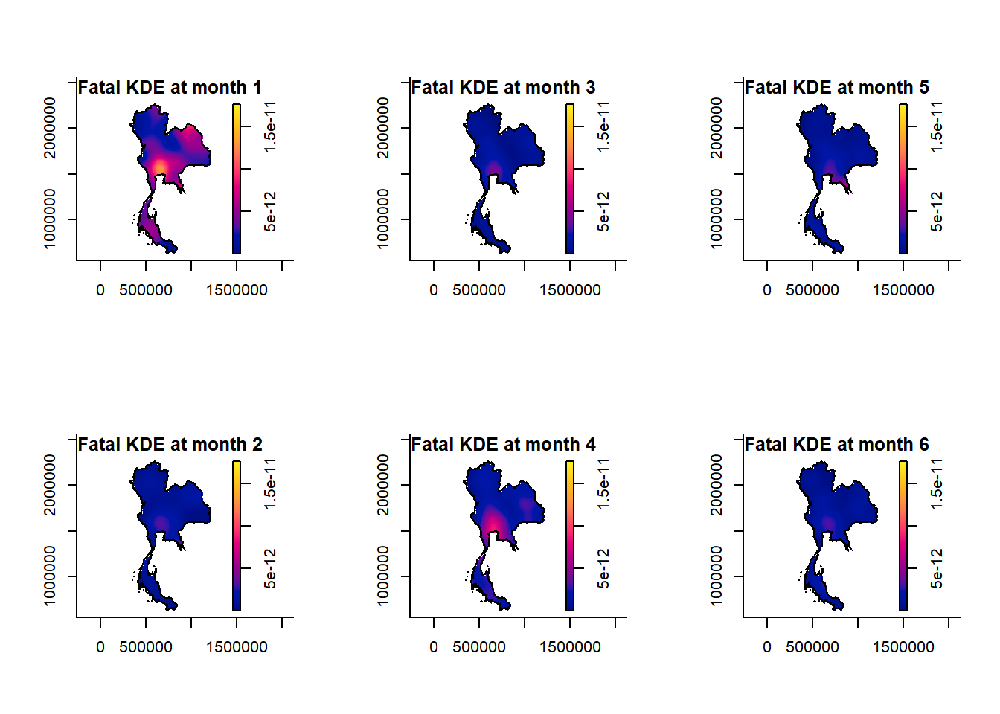
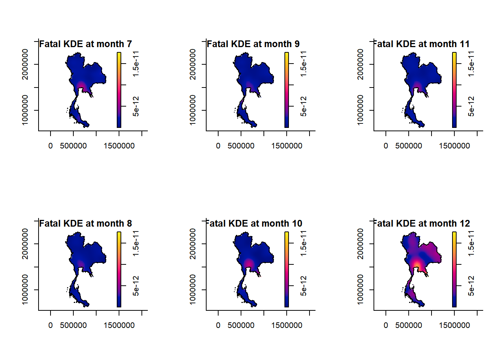
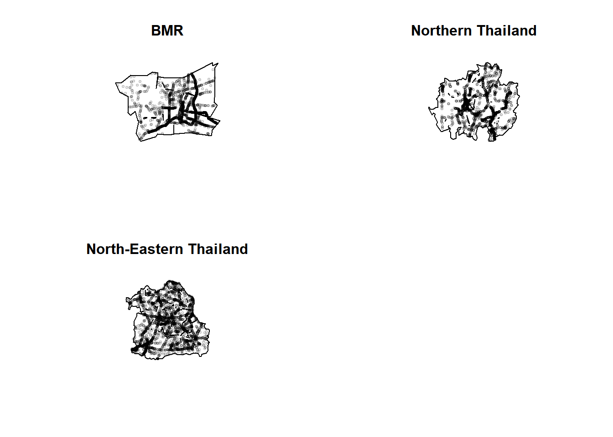
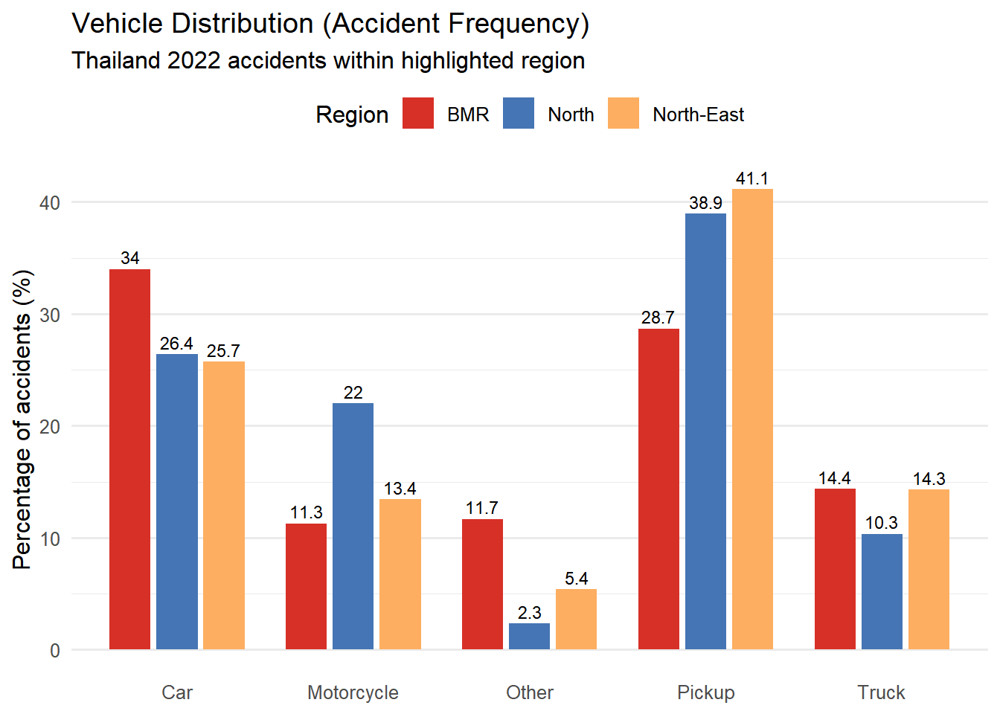
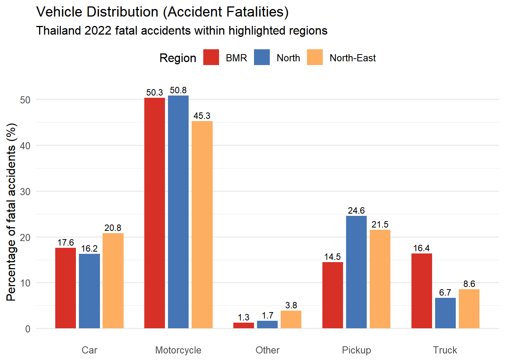
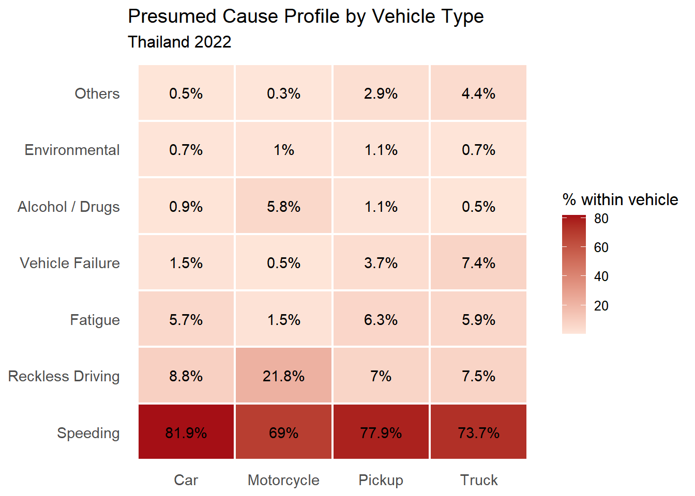

## Contents

| Section                             | Slide |
|:------------------------------------|:-----:|
| Overview                            |   3   |
| Data Preparations                   |   4   |
| First Order Point Pattern Analysis  |  5–7  |
| Second Order Point Pattern Analysis |   8   |
| Vehicle Distribution                |   9   |
| Accident Causes                     |  10   |
| Recommendations & Conclusion        |  11   |

## Overview

### Context

Public safety refers to the protection of the general public, communities, and critical infrastructure from crimes, disasters, accidents, and other major threats through coordinated government and agency action. Public safety can be supported via geospatial analysis by transforming location-based data into visual evidence. In this case, Thailand has one of the highest road death tolls in the world and is a major point of concern for public safety.

### Objectives

Gain proper insights on accidents occurring in Thailand in 2022 for better decisions and actionable(s) to reduce the accident rates in the country and in lieu the death toll.

## Data Preparations

**Data CSV columns:** acc_code, incident_datetime, report_datetime, province_th, province_en, agency, route, vehicle_type, presumed_cause, accident_type, number_of_vehicles_involved, number_of_fatalities, number_of_injuries, weather_condition, latitude, longitude, road_description, and slope_description

### Data preparations done:

- Handle Invalid/Missing Locations
- Removal of Unnecessary Columns & Rows
- Ensuring Unique Rows
- Coordinate Reference System (CRS) changed for Thailand coordinates

### Assumptions to note:

Reliability of original Dataset, Homogeneity, Independence, Isotropy.

## First Order Point Pattern Analysis

### Accident Frequency

::::: columns
::: {.column width="55%"}

:::

::: {.column width="45%"}
**Insights:**

- April and December peaks in accident numbers with January coming behind as a close third.
- Bangkok regions is a hot spot for accident occurrence through the red colour intensity in those months.
:::
:::::

## First Order Point Pattern Analysis {.smaller}

### Accident Fatalities

::::: columns
::: {.column width="55%"}
{height="230px"}

{height="230px"}
:::

::: {.column width="45%"}
**Insights:**

- Accident frequency and severity are following different spatial and temporal patterns.
- More fatal accidents in Northern, North-Eastern Thailand, and Bangkok at January and December.
- With higher fatalities in the 3 regions, all 3 regions will be expanded on for further analysis.
:::
:::::

## First Order Point Pattern Analysis

### Clark-Evans Test

::::: columns
::: {.column width="45%"}
{height="80%"}
:::

::: {.column width="55%"}
**Analysis:**

- **BMR:** R = 0.26425, p-value \< 2.2e-16. Statistically significant, most concentrated accident area.
- **Northern Thailand:** R = 0.29995, p-value \< 2.2e-16. Statistically significant, still a concentrated accident area.
- **North-Eastern Thailand:** R = 0.41683, p-value \< 2.2e-16. Statistically significant, concentrated, but least concentrated of the 3 regions.
:::
:::::

## Second Order Point Pattern Analysis

### K Function Test

- **BMR:** Clark-Evans test (R = 0.265, p \< 2.2 × 10⁻¹⁶), which identified strong nearest-neighbour clustering.
- **North Thailand:** Clark-Evans test (R = 0.3014, p \< 2.2 × 10⁻¹⁶), which identified strong nearest-neighbour clustering.
- **North-Eastern Thailand:** Clark-Evans result (R = 0.419, p \< 2.2 × 10⁻¹⁶), more deviation than Bangkok Metropolitan region and Northern Thailand.

## Vehicle Distribution

::::: columns
::: {.column width="50%"}
{width="1009"}
:::

::: {.column width="50%"}
{width="1008"}
:::
:::::

**Insights:**

- Passenger cars dominate in the Bangkok region (34.0%) while pickup only accounts for 28.7%.

- Motorcycles dominate being the cause of fatal accidents in all three regions, with 50.3% in the BMR, 50.8% in the North, and 45.3% in North-Eastern Thailand.

- Motorcyclists are at greatest risk of dying overall when in an accident

## Accident Causes

::::: columns
::: {.column width="50%"}
{width="1065"}
:::

::: {.column width="50%"}
{width="1065"}
:::
:::::

**Insights:**

- Speeding dominates all three regions (71.3%–78.5%), though variation can be seen in smaller causes.
- Reckless driving is disproportionately recorded for motorcycle accidents (21.8%), compared to 7%–8.8% for all other vehicles.
- Vehicle failure concentrates in trucks (7.4%), while alcohol/drug involvement is highest for motorcycles (5.8%).

**Caveat :** Cause of the accident is likely to be deemed through field judgment/recording practice rather than a forensic finding

## Recommendations & Conclusion

#### Recap of Analysis Findings

The spatio-temporal kernel density estimates and Clark-Evans tests provide strong evidence that road traffic accidents in Thailand are not randomly distributed, and all three highlighted regions — the Bangkok Metropolitan Region (BMR), Northern Thailand, and North-Eastern Thailand — show statistically significant clustering (p \< 2.2 × 10⁻¹⁶).

BMR has the strongest clustering (R = 0.265) and functions as a constant accident hotspot. But the Northern and North-Eastern regions have an elevated fatality intensity despite showing dispersed patterns (R = 0.301 and R = 0.419, respectively), especially in January and December.

#### Recommendations & Way Ahead

- **BMR:** Targeted infrastructure investment into road redesigning, improved signages, and speed-calibration measures at specific highway segments identified in the K-function plots.
- **Northern & North-Eastern Thailand:** Enhanced emergency medical services and faster response times, given the association between rurality, delayed treatment, and higher death rates.
- **Seasonal peaks (January, April, December):** Schedule enforcement campaigns — speed checks, DUI checkpoints, and patrols — with more focus on automated police cameras to stop speeding.
- **Motorcycles:** Mandatory helmet use, rider training, and infrastructure separation.
