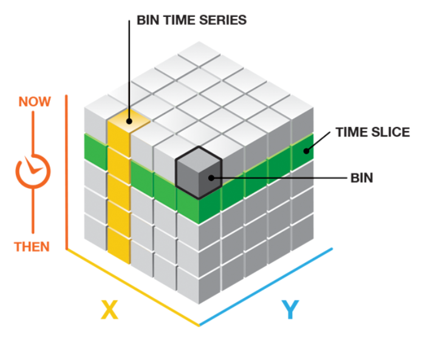
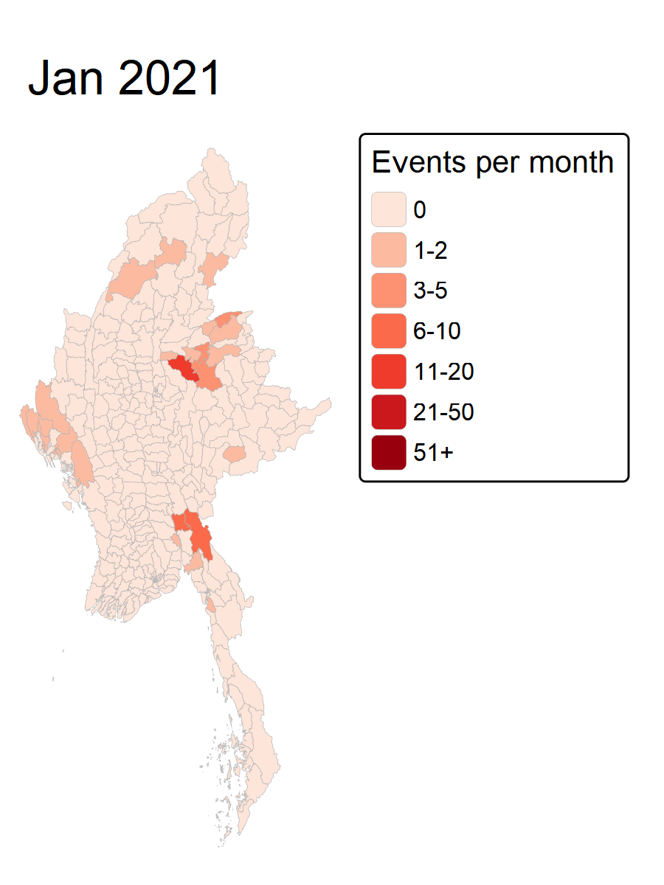

# Overview

::: callout-warning
STILL A WORK IN PROGRESS (WIP)

NOT DONE YET ONLY DRAFTING OF OUTLINE!
:::

Since gaining independence from the UK in 1948, Myanmar has been in one of the world's longest ongoing civil war. Ethic armed organisations have been fighting Myanmar's armed forces for self-determination. Even with the numerous ceasefires, armed groups continue to call for independence, increased autonomy, democracy, or the federalisation of Myanmar.

In February 2021, the military of Myanmar has taken over the country after overthrowing the 2020 elected government that is supposed by the National League for Democracy. However instead of restoring order like many had hoped the Junta's repression followed with brutal crackdowns instead. This caused millions of civilians to abandon the peaceful protests to take up arms or seek refuge in dense forests and mountainous borderlands. Consequently, the country has descended into an all-out civil war that has claimed thousands of lives, displaced over three million people, and fractured Myanmar into competing zones of control, leaving vast stretches of territory entirely outside the junta's reach.

## Objectives

This Take-Home Exercise explores the usage of Local Measures of Spatial Association methods and Emerging Hot Spot Analysis to identify, assess and geovisualizing the spatial distribution, patterns and trends of armed conflict in the Myanmar at township level from **1st January 2021 to 30th September 2025.**

The specific objectives of this take-home exercise are:

- To pinpoint exact geographic hotspots, cold spots, and spatial outliers where violence clusters or behaves unusually compared to surrounding townships.

- To reveal where, how fast, and in what pattern political violence is evolving over space and time.

This is to assist in the overall objectives on peace-building initiatives and preventing further armed conflicts in the country.

# Data

These are the datasets used for this exercise

## Geospatial Data

**Myanmar Township Boundaries MIMU v9.4** is a geospatial dataset that delineates the boundaries of Myanmar. This data is presented in the ESRI shapefile format and is based on the WGS 84 geographic coordinate system. This data is extracted from [MIMU Geonode](https://geonode.themimu.info/).

## Aspatial Data

**Armed Conflict Location & Event Data Project (ACLED)** will be used. This is an aspatial tabular dataset (CSV) that records political violence and conflict events across Myanmar from January 2021 to September 2025.Geographic point coordinate attributes (latitude and longitude in decimal degrees) are incorporated for spatial referencing. This data is is taken from SMU's E-LEARN Site.

# Getting Started

## Loading of Packages

First the required packages will be loaded into R. The details of each package is as follows :

```{r}
pacman::p_load(sf, tidyverse, lubridate, sfdep, spacetime, Kendall,
               spdep, tmap,kableExtra, viridis, knitr,gifski)
```

```{r}
#| echo: false
#| message: false
#| warning: false

package_table <- tribble(
  ~Package, ~Purpose, ~`Use Case in Exercise`,
  "sf", "Handles spatial data; imports, manages, and processes vector-based geospatial data.", "Importing and managing geospatial data, such as Myanmar's administrative boundary shapefile.",
  "tidyverse", "A collection of R packages for data science tasks like data manipulation, visualization, and modeling.", "Wrangling aspatial ACLED conflict data and joining it with geospatial datasets.",
  "lubridate", "Provides functions to work with dates and time intervals easily.", "Parsing date fields in the ACLED Myanmar dataset into temporal units (e.g., years, months).",
  "sfdep", "Provides functions for spatial autocorrelation and temporal analysis, including Emerging Hot Spot Analysis (EHSA).", "Performing spatio-temporal analysis using Gi* statistics and Mann-Kendall test.",
  "spacetime", "Provides classes and methods for spatio-temporal data handling and aggregation.", "Constructing spatio-temporal cubes to structure conflict event data over time and space.",
  "Kendall", "Provides functions for performing the Mann-Kendall test for detecting trends in time series data.", "Performing the Mann-Kendall test to assess the trends in Gi* statistics over time.",
  "spdep", "Creates spatial weights matrix objects and tests for spatial autocorrelation.", "Constructing spatial weight matrices (e.g., Queen contiguity) for spatial analysis.",
  "tmap", "Creates static and interactive thematic maps in R.", "Visualizing spatial distributions and spatio-temporal patterns (e.g., EHSA hotspots) on maps.",
  "kableExtra", "Extends knitr::kable() to build complex, styled HTML and PDF tables.", "Formatting and styling summary tables for reporting.",
  "viridis", "Provides colorblind-friendly color maps for data visualization.", "Enhancing map legibility with accessible color schemes for spatial and temporal plots.",
  "knitr", "Provides dynamic report generation and table rendering tools in R.", "Rendering formatted tables in R Markdown / Quarto documents."
)

package_table %>%
  kbl(col.names = c("Package", "Purpose", "Use Case in Exercise")) %>%
  kable_styling(bootstrap_options = c("hover", "condensed"), full_width = TRUE) %>%
  column_spec(1, bold = TRUE, width = "15%") %>%
  column_spec(2, width = "45%") %>%
  column_spec(3, width = "40%")
```

## Importing of Data

### Geospatial Data

```{r}
mmr_sf <- st_read(dsn = "data/geospatial/Myanmar",
                   layer = "mmr_polbnda_adm3_250k_mimu_1") %>%
  st_transform(crs = 32647)


```

### Aspatial Data

```{r}
acled<- read_csv("data/aspatial/ACLED_Data_Myanmar_Jan2021-Sep2025.csv") %>%
                   st_as_sf(coords = c("longitude", "latitude"), crs = 4326) %>%
                   st_transform(crs = 32647)

acled
```

From the output above, we can observe that there are 31 columns with 87109 records in this dataset.

The code below is also run to ensure that the date window of the aspatial dataset is set to Jan 2021 to Sep 2025 as according to objectives of the exercise

```{r}
acled <- acled %>% filter(event_date >= "2021-01-01", event_date <= "2025-09-30")
range(acled$event_date)
```

## Data Wrangling

Within the Data Wrangling, these processes will be conducted to check the data and prepare it for the geospatial analysis (Tasks 1-3)

- Duplicate Values

- Missing Data

- Removing Unnecessary Columns

- Removing Unnecessary Rows

- Joining of datasets

- Creating Time unit

- Aggregating and completing cube

### Duplicate Values 

First, checks are done to the aspatial data to ensure there are no duplicated values (rows and columns). This is to ensure there is no double counting in our values as the analysis can be done. Duplicate values if its present within the data will cause the data to skew and impact the accuracy of analysis.

```{r}
# Checks for duplicated rows 
sum(duplicated(acled))

# Checks for Duplicated Columns
any(duplicated(names(acled)))
```

Now the same will be done to the geospatial data.

```{r}
# Checks for duplicated rows 
sum(duplicated(mmr_sf))

# Checks for Duplicated Columns
any(duplicated(names(mmr_sf)))
```

With alls outputs being `0` or `FALSE`, there are 0 duplicated values in both datasets and it can be concluded that every row and column (event) is unique

### Missing Data 

Sometimes, data collection would not be clean and this is very common in real world datasets. Missing data would again impact the accuracy of the analysis, where some insights may be missed due to the missing data. Therefore the checks here are done.

First we would check the missing data from the aspatial dataset.

```{r}
null_counts <- sapply(acled, function(x) sum(is.na(x)))
null_counts
```

It can be noted that there are missing values in `assoc_actor_1` , `actor2` , `assoc_actor_2`, `inter2`, `admin3`, and `tags` , after investigation the columns as shown actually are to provide supplementary data where the empty cells are as such since there no additional data exists.

E.g An unknown assailant shot a man to death on Jan 2021. This does not have associated actors which is why `assoc_actor_1` and `assoc_actor_2` are left as blank (NA).

However `civilian_targeting` is a column stating if the event itself in the dataset is a civil dispute targeting a civilian, where original data shows `civilian_targeting` or NA. Therefore a better way to frame the columns is to put a YES or NO Binary rather than leaving the non Civilian_targeting events as blank. The code chunk below will fix this issue.

```{r}
# Changing cells to a YES/NO binary form 
acled <- acled %>%
  mutate(
    civilian_targeting = if_else(is.na(civilian_targeting), "No", "Yes")
  )

#Verification of data 
acled %>%
  count(civilian_targeting)
```

Now we will look at the geospatial dataset.

```{r}
geonull_counts <- sapply(mmr_sf, function(x) sum(is.na(x)))
geonull_counts
```

With all values being `0`, it can be confirmed that the geospatial dataset does NOT have any missing values.

### Removing Unnecessary Columns

For the Datasets, after the analysis of the specifc columns available, the selected columns are kept or removed with the following reasons in the tables below.

#### Aspatial Columns 

```{r}
#| echo: false
#| message: false
#| warning: false

#Table format generation 
make_tbl <- function(df) {
  df %>%
    kbl() %>%
    kable_styling(bootstrap_options = c("hover", "condensed", "striped"),
                  full_width = TRUE) %>%
    column_spec(1, bold = TRUE)
}

acled_kept <- tibble::tribble(
  ~Column,               ~Reason,
  "event_id_cnty",       "Unique event ID. Used for the duplicate check.",
  "event_date",          "Used to build the monthly time index for the space-time cube.",
  "disorder_type",       "Used to define type of armed conflict.",
  "event_type",          "Used to filter events and count them by type.",
  "sub_event_type",      "Allows a finer breakdown of event types if needed.",
  "civilian_targeting",  "Yes/No variable, used to count civilian-targeted events.",
  "fatalities",          "To look at the severity of each event (by death count).",
  "geo_precision",       "Used to assess how reliable each event location is.",
  "geometry",            "Event points, needed for the spatial join to the geospatial dataset"
)


make_tbl(acled_kept)


```

```{r}
acled_removed <- tibble::tribble(
  ~Column,                                                       ~Reason,
  "year",  "Redundant, as it can be derived from event_date.",
  "time_precision", "Only needed to assess date reliability, which is not part of the objectives.",
  "iso, region, country", "Constant for Myanmar, so they carry no information.",
  "admin1, admin2, admin3, location", "Replaced by the township from the spatial join. admin3 also has 1,118 NAs and its names may not match MIMU.",
  "actor1, inter1","Optional. Only needed for actor-level breakdowns, which the objectives do not ask for.","actor2, assoc_actor_1, assoc_actor_2, inter2, interaction","Many structural NAs (no second actor or association exists) and not required by the objectives.","source, source_scale, notes, tags","Free text or source metadata with no use in counting events.","timestamp", "Data-entry metadata."
)

#| echo: false
make_tbl(acled_removed)

```

Now the following code below is used to keep the columns that needs to be kept.

```{r}
acled <- acled %>%
  select(event_id_cnty, event_date, disorder_type, event_type,
         sub_event_type, civilian_targeting, fatalities, geo_precision)
```

```{R}
names(acled)
```

#### Geospatial Columns 

```{r}
#| echo: false
#| message: false
#| warning: false

geo_kept <- tibble::tribble(
  ~Column,      ~Reason,
  "ST",         "State/region name. Used to describe where clusters and hotspots sit at the state level.",
  "DT",         "District name. Provides context and helps tell apart townships that share a name.",
  "TS",         "Township name (English). Used for map labels and for naming hotspots in the write-up.",
  "TS_PCODE",   "Unique township code. Used as the join key to the ACLED counts and as the location ID in the space-time cube.",
  "geometry",   "Township polygons. Needed for mapping, spatial weights and the spatial join."
)

make_tbl(geo_kept)
```

```{r}

#| echo: false
#| message: false
#| warning: false

geo_removed <- tibble::tribble(
  ~Column,      ~Reason,
  "ST_PCODE",   "State/region code. Redundant :dataset already has state name (ST) and unique township key (TS_PCODE).",
  "DT_PCODE",   "District code. Redundant : dataset already has district name (DT) and unique township key (TS_PCODE).",
  "TS_MMR",     "Township name in Burmese. The English version (TS) is already available.",
  "PCode_V",    "Pcode version number. No analytical use."
)


make_tbl(geo_removed)
```

Therefore the code below will remove the unneeded Columns.

```{r}
mmr_sf <- mmr_sf %>% select(ST, DT, TS, TS_PCODE)

```

```{r}
names(mmr_sf)
```

### Removing Unnecessary Rows 

Since the objectiveis to look at **armed conflict** in the Myanmar specifically, it is crutial to know what are the types of conflicts within the dataset (Myanmar) before proceeding on to the deeper analysis. However as shown through the table below, there are 6 types of conflicts, of which some are NOT armed conflicts.

```{r}
acled %>% st_drop_geometry() %>% count( event_type, sort = TRUE)
```

Therefore, according to the table below, the following event types will be kept or filtered out with the reasoning.

```{R}
#| echo: false
#| message: false
#| warning: false

event_acled <- tibble::tribble(
  ~`Event type`, ~Decision,  ~Reason,
  "Battles","Keep","Direct armed clashes between organised groups.","Explosions/Remote violence", "Keep", "Airstrikes, shelling, drone strikes, landmines and IEDs. Centrally used in armed conflicts.",
  "Violence against civilians", "Keep", "Armed attacks on citizems by state or non-state actors. Relevant form of political violence.",
  "Protests","Remove",   "Mostly peaceful demonstrations for civil unrest, not armed conflict.","Riots", "Remove",   "Mob violence/demonstrations without organised armed actors,a different phenomenon.","Strategic developments", "Remove", "Non-violent events such as arrests."
)

make_tbl(event_acled)
```

```{r}
keep_events <- c("Battles",
                 "Explosions/Remote violence",
                 "Violence against civilians")

n_before <- nrow(acled)

acled <- acled %>%
  filter(event_type %in% keep_events)

n_after <- nrow(acled)

# check no of rows removed 
cat("Before:", n_before, "| After:", n_after, "| Removed:", n_before - n_after, "\n")

```

### Joining of datasets 

Now with the datasets cleaned, the geospatial dataset and aspatial dataset will be joined. However rather than this being a usual attribute join, we will be joining via a spatial join. This is because the two datasets have no shared column. But it is possible to link the datasets via the geometry column (through the location)

```{r}
# Joining of datasets
acled_ts <- st_join(acled,
                    mmr_sf %>% select(TS_PCODE, TS, DT, ST),
                    join = st_within)

# Check to ensure no duplicated data 
nrow(acled_ts) == nrow(acled)  

# Check to see number of events that cannot be matched with joined geospatial dataset. 
sum(is.na(acled_ts$TS_PCODE))               
```

Since there are 12 rows of data that are not matched after the join. Even though it is also possible to just drop these rows entirely, there is actually no missing values within the Geometry data which is where the coordinates are put in.

Therefore, the following code below will help to re-assign these 12 events to the nearest township, with assumption that these 12 event locations are at the border of the re-assigned towns.

```{r}
na_idx <- which(is.na(acled_ts$TS_PCODE))
nearest <- st_nearest_feature(acled_ts[na_idx, ], mmr_sf)
acled_ts$TS_PCODE[na_idx] <- mmr_sf$TS_PCODE[nearest]

sum(is.na(acled_ts$TS_PCODE))   

```

Now all the events are matched in the joined dataset, and we can proceed on to the creation of time unit and aggregating the cube for the analysis.

### Creating SpaceTime Cube 

Within the sfdep package, to be able to represent the spatio-temporal data for the Geospatial analysis and Emerging HotSpot Analysis (EHSA) , the spacetime class would be used since it is able to hold both the spatial and temporal aspects of the data required.

{width="356"}

So to create a spacetime object four items are required :

- Data : tibble of conflict counts

- geometry : an sf object of township boundaries (mmr_sf)

- location identifier : Column in both data in geometry (TS_PCODE)

- Time : Month index in data to as a column holding the temporal based data.

In here, every township should appear in every month, including township without any conflicts to ensure the cube is complete. The 4 steps below would help to create the cube :

#### Creating Time unit 

First the time unit of the months would be created since the Time factor as stated above is required to create the spacetime cube.

```{r}
acled_ts <- acled_ts %>%
  mutate(month = floor_date(event_date, "month"),
         t_idx = interval(ymd("2021-01-01"), month) %/% months(1) + 1)

range(acled_ts$t_idx)   
```

Since we know there are 57 months output should be 1, 57. Which is the case so there is no issues with this first step and can proceed on to step 2.

#### No of conflict event by Township & Month 

The code below will count by Month (Temporal) and Township (Spatial) the number of conflicts that had occurred in the 57 months.

```{r}
counts <- acled_ts %>%
  st_drop_geometry() %>%
  group_by(TS_PCODE, t_idx) %>%
  summarise(n_events = n(), fatalities = sum(fatalities), .groups = "drop")
```

#### Accounting for Zeros 

Townships with no events in a month will not appear in `counts`. So an additional step is required to add these township back with zero counts.

```{r}
cube_df <- counts %>%
  complete(TS_PCODE = mmr_sf$TS_PCODE,
           t_idx = 1:57,
           fill = list(n_events = 0, fatalities = 0))

nrow(cube_df) == nrow(mmr_sf) * 57   
```

#### Create spacetime object 

Finally now the spacetime object can be created.

```{r}
acled_st <- spacetime(cube_df, mmr_sf,
                      .loc_col  = "TS_PCODE",
                      .time_col = "t_idx")

is_spacetime_cube(acled_st)   
```

The TRUE Confirms the creation of the spacetime cube!

## Plotting of Data

First a second join is made to get the number of events that had occured in each township so the plotting can be done

```{r}
ts_counts <- acled_ts %>%
  st_drop_geometry() %>%
  count(TS_PCODE, name = "n_events")

mmr_events <- mmr_sf %>%
  left_join(ts_counts, by = "TS_PCODE") %>%
  mutate(n_events = replace_na(n_events, 0))   

sum(mmr_events$n_events) == nrow(acled_ts) 

```

Now the map will be plotted out.

```{r}
#| fig-width: 9
#| fig-height: 14
#| echo: false
#| message: false
#| warning: false

tm_shape(mmr_events) +
  tm_polygons(col = "n_events",
              style = "jenks", n = 6,
              palette = "Reds",
              title = "Number of events",
              border.col = "grey60", lwd = 0.3) +
  tm_layout(main.title = "Armed conflict events by township",
            main.title.size = 1.1,
            legend.position = c("left", "bottom"),
            legend.text.size = 0.8, legend.title.size = 1,
            frame = FALSE,
            outer.margins = 0, inner.margins = 0.02)
```

::: callout-note
## Analysis

...
:::

```{r}
months_lbl <- seq(ymd("2021-01-01"), by = "month", length.out = 57)

cube_sf <- mmr_sf %>%
  select(TS_PCODE) %>%
  left_join(cube_df, by = "TS_PCODE") %>%      
  mutate(month = factor(format(months_lbl[t_idx], "%b %Y"),
                        levels = format(months_lbl, "%b %Y")))

max(cube_sf$n_events)   
```

Now we plot out the time series animated plot

```{r}
#| echo: false
#| message: false
#| warning: false

dir.create("frames", showWarnings = FALSE)
month_levels <- levels(cube_sf$month)

for (i in seq_along(month_levels)) {
  m <- tm_shape(cube_sf %>% filter(month == month_levels[i])) +
    tm_polygons(
      fill = "n_events",
      fill.scale = tm_scale_intervals(
        breaks = c(0, 1, 3, 6, 11, 21, 51, Inf),
        labels = c("0", "1-2", "3-5", "6-10", "11-20", "21-50", "51+"),
        values = "brewer.reds"),
      fill.legend = tm_legend(title = "Events per month"),
      col = "grey70", lwd = 0.2) +
    tm_title(month_levels[i]) +
    tm_layout(frame = FALSE)
  
  tmap_save(m, filename = sprintf("frames/frame_%02d.png", i),
            width = 900, height = 1200)
}

gifski(list.files("frames", pattern = "png$", full.names = TRUE),
       gif_file = "acled_monthly.gif",
       width = 900, height = 1200,
       delay = 0.6)
```

```{r}

```

## Assumptions & Limitations in data

### CRS on Both Datasets

The EPSG:4326 is used to importing and storing raw latitude/longitude points for both aspatial and geospatial datasets. However this is not suitable for the spatial analytics in this exercise across Myanmar. Hence a transformation is required to EPSG:32647 (UTM Zone 47N). This is done during the importing of the datasets `st_transform(crs = 32647)`

# Task 1 : Geospatial Data Science

# Task 2 : Local Measures of Spatial Association (LMSA) Analysis

# Task 3: Emerging Hot Spot Analysis (EHSA)

# Analysis Summary & Conclusions

# Limitations & Future Research
